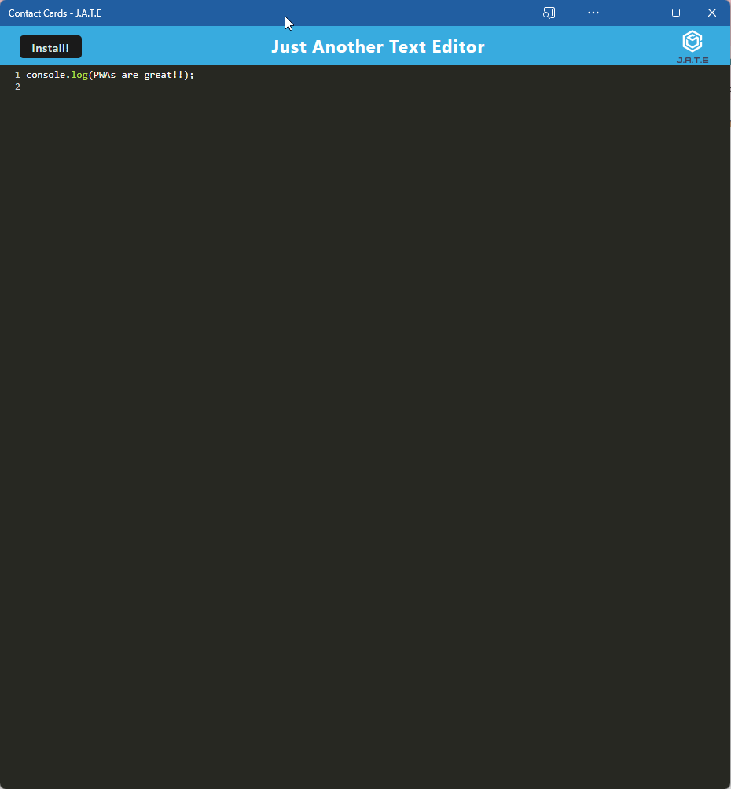

# Text Editor (PWA)

## Description
This text editor app runs in the browser and is a single-page application that meets the PWA criteria. It features a number of data persistence techniques that serve as redundancy in case one of the options is not supported by the browser. This application also functions offline. It was built with an existing application and methods for getting and storing data to an IndexedDB database was implemented. A package called `idb` was used, which is a lightweight wrapper around the IndexedDB API. It features a number of methods that are useful for storing and retrieving data. Finally, this full-stack application was deployed to Heroku.
As shown above in the screenshot, this app opens without any browser after the user clicks the install button.

## Table of Contents
* [Usage](#usage)
* [License](#license)
* [Contributing](#contributing)
* [Tests](#tests)
* [Questions](#questions)

## Usage
💻

Browse to this link to access the PWA text editor: `https://still-spire-97146.herokuapp.com/`

## License
This project is licensed under MIT.

## Contributing
Anyone can contribute to this project. Please make sure to fork this repo.

## Tests
No tests were used for this project.

## Questions
If you have any questions about this project, please contact me.
You can view more of my projects at https://github.com/Rakibca.
